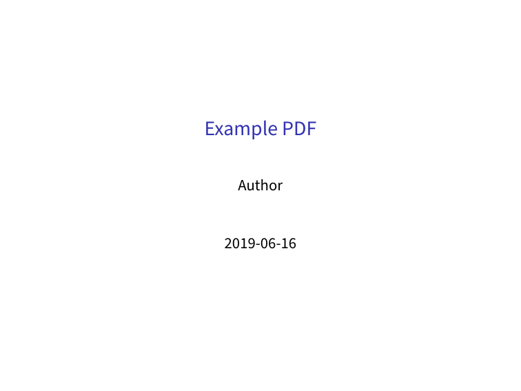

---
title: Basic Example
parent: Examples
...

# Basic Example

## Command

``` bash
pandoc "document.md" -o "document.pdf" --from markdown --to beamer --template "../../eisvogel.tex" --listings
```

## Preview

