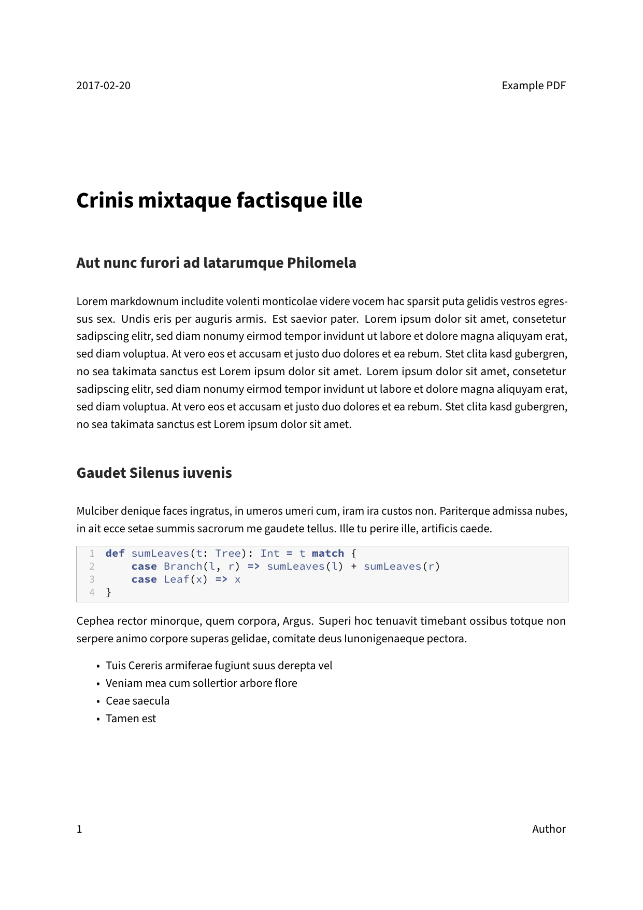

---
title: Book
parent: Examples
...

# Book

## Command

``` bash
pandoc "document.md" -o "document.pdf" --from markdown --template "../../eisvogel.tex" --listings --top-level-division="chapter"
```

## Preview

[View the resulting PDF file.](document.pdf)

[](document.pdf)