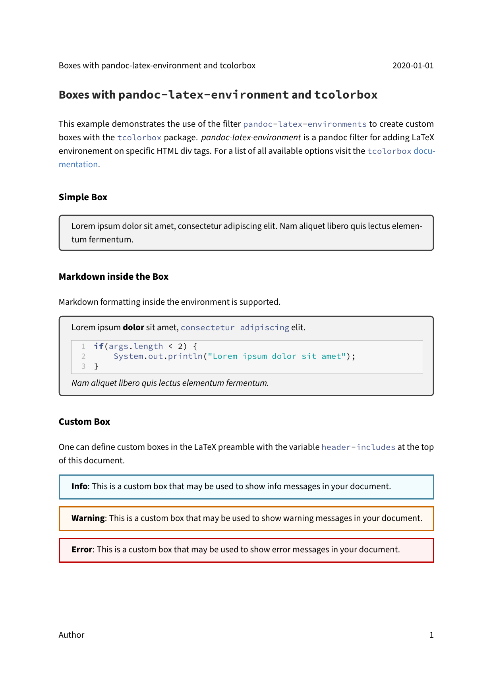

---
title: Boxes with pandoc-latex-environment and tcolorbox
parent: Examples
...

# Boxes with `pandoc-latex-environment` and `tcolorbox`

## Command

``` bash
pandoc "document.md" -o "document.pdf" --from markdown --template "../../eisvogel.tex" --filter pandoc-latex-environment --listings
```

## Preview

[](document.pdf)