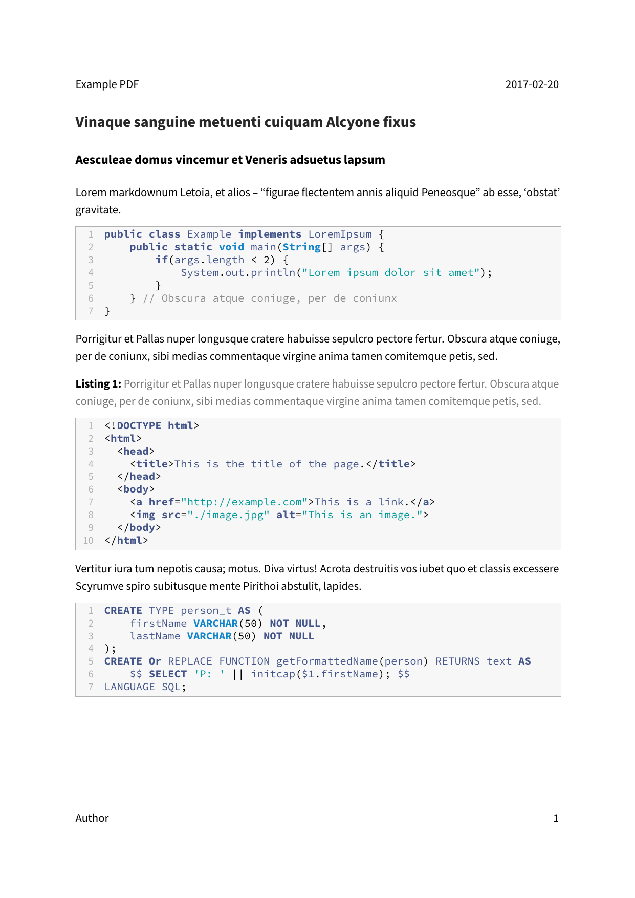

---
title: Code Blocks listings
parent: Examples
...

# Code Blocks `listings`

## Command

``` bash
pandoc "document.md" -o "document.pdf" --from markdown --template "../../eisvogel.tex" --listings
```

## Preview

[](document.pdf)