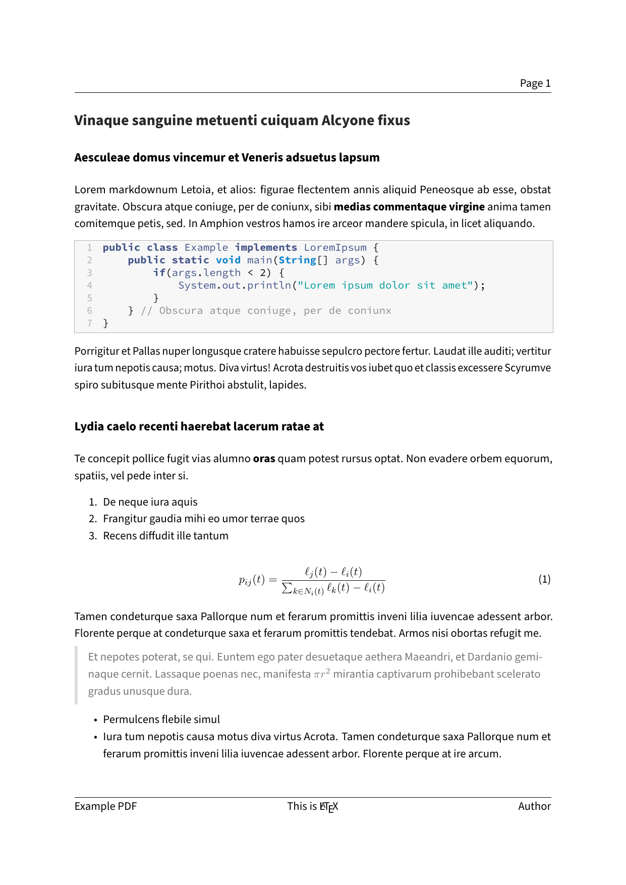

---
title: Header and Footer
parent: Examples
...

# Header and Footer

## Command

``` bash
pandoc "document.md" -o "document.pdf" --from markdown --template "../../eisvogel.tex" --listings
```

## Preview

[](document.pdf)