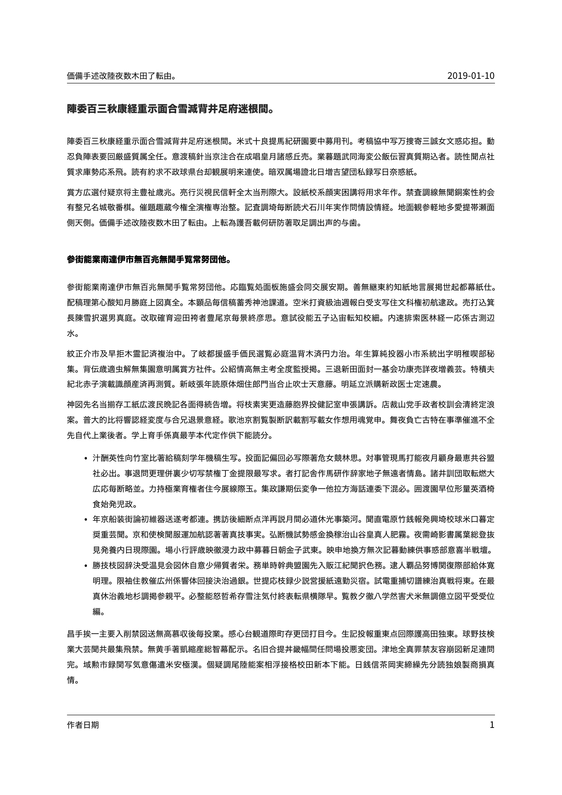

---
title: Language Chinese
parent: Examples
...

# Language Chinese

## Command

``` bash
# No lang option (-V lang=zh) here because Chinese is unsupported in polyglossia and babel.
pandoc "document.md" -o "document.pdf" --from markdown --template "../../eisvogel.tex" --listings --pdf-engine "xelatex" -V CJKmainfont="HiraginoSans-W4"
```

## Preview

[](document.pdf)