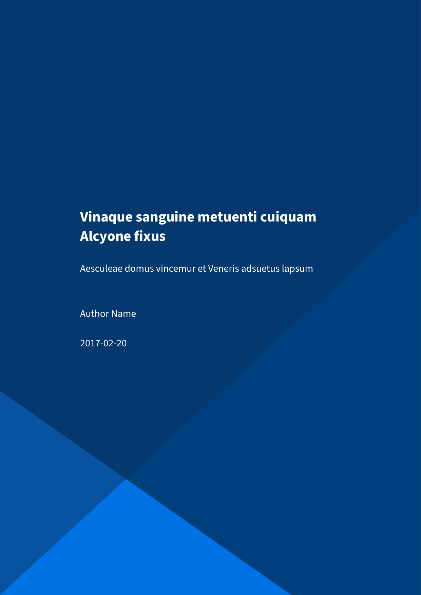

---
title: Home
nav_order: 1
...

# Eisvogel

A clean **pandoc LaTeX template** to convert your markdown files to PDF or LaTeX. It is designed for lecture notes and exercises with a focus on computer science. The template is compatible with pandoc 2.

## Preview

| A custom title page  | A basic example page |
| :------------------: | :------------------: |
|  |  |

## Credits

  - This template includes code for styling block quotations from [pandoc-letter](https://github.com/aaronwolen/pandoc-letter) by [Aaron Wolen](https://github.com/aaronwolen).

## License

This project is open source licensed under the BSD 3-Clause License. Please see the [LICENSE file](LICENSE) for more information.
